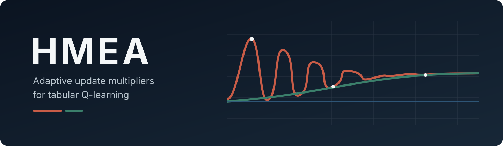
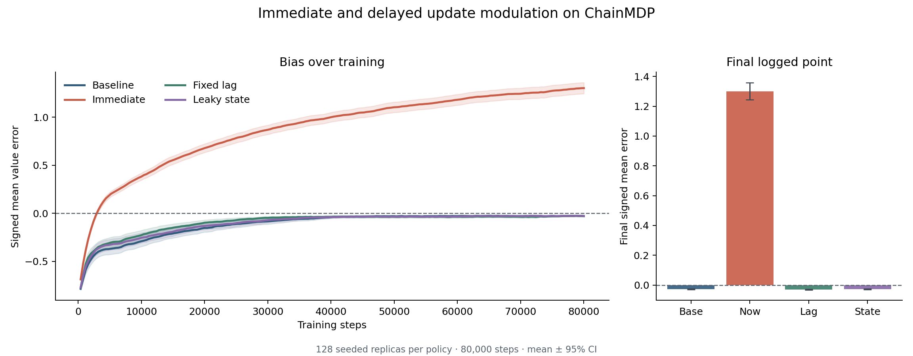

<p align="center">
  
</p>

# hmea-agent

A compact NumPy diagnostic for measuring how adaptive update multipliers change tabular
Q-learning, with reproducible comparisons that run on a CPU.


[](https://github.com/yniantongtian-oss/hmea-agent/actions/workflows/ci.yml)
[](LICENSE)


<p align="center">
  
</p>

The included experiment uses the same environment, seed streams, and training schedule for
four update rules. In this controlled case, a multiplier computed from the current TD error
pushes value estimates upward, while delayed signals stay close to the unmodified baseline.
The figure is an empirical result for this configuration, not a general convergence claim.

## What it does

HMEA holds the environment, random seeds, and training schedule constant while changing only
the rule that scales each temporal-difference update. It then reports estimation bias, RMSE,
start-state value, confidence intervals, and whether the rule reads the current TD error.

Use it to answer a narrow but important question: does an adaptive multiplier improve a result,
or does feedback from the current error quietly distort the value estimates?

## Why use it

HMEA is intended for reinforcement-learning students, researchers, and engineers who want a
small experiment they can inspect end to end. It helps users:

- compare update policies under the same environment, seeds, and training schedule;
- measure paired differences against a reference policy, with reproducible uncertainty intervals;
- detect feedback-driven estimation bias instead of relying only on average reward;
- inspect per-seed bias, RMSE, start-state values, and final Q-tables;
- test a custom multiplier through a small protocol with explicit structural checks;
- reproduce a reference result on a CPU without a framework or accelerator.

## Run it without writing code

Clone the repository, install the package, and run the short comparison:

```bash
git clone https://github.com/yniantongtian-oss/hmea-agent.git
cd hmea-agent
python -m pip install -e .
python -m hmea
```

Installing the package also adds the equivalent `hmea-compare` command. The default run uses
5,000 steps and 16 seeded replicas, then prints bias, RMSE, confidence intervals, and whether
each policy reads the current TD error.

Useful variants:

```bash
# Run one policy with a larger sample.
python -m hmea --policy fixed-lag --steps 20000 --seeds 64

# Print JSON for a notebook, script, or CI job.
python -m hmea --policy baseline --json

# Change the controlled environment without editing Python.
python -m hmea --states 12 --gamma 0.97 --reward-noise 0.2

# Save a self-contained CSV row for each policy.
python -m hmea --format csv --output results.csv

# Run the deterministic reference configuration.
python -m hmea --full
```

The command does not require Matplotlib and writes a file only when `--output` is supplied.
JSON and CSV results include the experiment configuration and package versions needed to audit
the run. Results still describe the included chain environment only.

## Compare against the baseline

This feature is available on the default branch, but is not part of the v0.2.0 release. Clone
the repository and install it with `python -m pip install -e .` before running the commands below.

Add `--compare-to baseline` to measure each candidate's difference from ordinary Q-learning,
pairing the final metrics from matching seeded replicas:

```bash
# Compare all built-in candidates with the baseline.
python -m hmea --compare-to baseline

# Save a larger paired comparison for one candidate.
python -m hmea --policy fixed-lag --compare-to baseline --full --format json --output comparison.json
```

The report shows absolute results and paired differences with approximate 95% bootstrap
intervals. Read each difference as **candidate minus reference**:

- **RMSE:** negative means lower estimation error than the reference in this experiment.
- **Signed bias:** negative means a downward shift, not necessarily an improvement.
- **An interval spanning zero:** the comparison is inconclusive, not evidence of equivalence.

The reference is trained automatically, using the same configuration and seed count. Paired mode
requires at least two seeds. The `--full` preset uses 80,000 steps and 128 seeds; explicit
`--steps` and `--seeds` values override the preset.

Without `--compare-to`, the existing output formats remain unchanged. Paired JSON includes
per-seed differences; paired CSV contains one summary row per candidate and metric. These are
exploratory comparisons, not a leaderboard or a claim about other environments. Follow the
[comparison guide](docs/comparing-policies.md) for export formats, repeatable runs, and
interpretation details.

## What is included

- A vectorized two-action `ChainMDP` with deterministic dynamics and optional reward noise.
- Batched tabular Q-learning with separate action-selection streams for each seed.
- Baseline, immediate, clipped, fixed-lag, and leaky-state modulation policies.
- Per-seed bias, RMSE, and start-state value logs.
- Paired reference comparisons for final RMSE and signed bias, with NumPy-only bootstrap intervals.
- Reproducible comparison scripts, a throughput benchmark, tests, packaging checks, and
  GitHub contribution templates.

The project name is retained from the original prototype. Here, *homeostatic* refers only to
a scalar leaky controller that tracks TD-error deviation from a setpoint. It does not model
emotion or consciousness.

## Install for Python use

From the repository root:

```bash
python -m pip install -e ".[plot]"
```

The `plot` extra is needed only for the scripts that write PNG figures. The installed command
and Python API require NumPy only.

For tests and contributor tools:

```bash
python -m pip install -e ".[dev]"
```

## Quick example

```python
from hmea import ChainMDP, HomeostaticModulation, QAgent, audit

env = ChainMDP(n_states=8, gamma=0.99, sigma_r=0.1)
modulator = HomeostaticModulation(eta=0.05, bounds=(0.5, 1.5))
agent = QAgent(env, modulator, seed=7)

log = agent.train(n_steps=20_000, n_seeds=64, log_every=500)

print(audit(modulator))
print(f"final mean bias: {log['bias'][-1]:+.4f}")
print(f"final mean RMSE: {log['rmse'][-1]:.4f}")
```

`audit()` reports declared structure such as bounds, lag, and whether a policy reads the
current TD error. It is an interface check; it does not certify learning behavior.

## Reproduce the comparison

```bash
python experiments/reproduce_bias_comparison.py
```

The default run trains 128 seeded replicas per policy for 80,000 steps and rewrites
`assets/bias_comparison.png`. A short smoke run is also available:

```bash
python experiments/reproduce_bias_comparison.py --quick
```

The default configuration includes deterministic regression thresholds. Custom or quick
runs check only that outputs are finite and correctly shaped.

To generate the secondary training-dynamics figure:

```bash
python experiments/training_dynamics.py
```

## Core API

| Object | Purpose |
|---|---|
| `ChainMDP` | Small left/right environment with an exact expected `Q*` baseline |
| `QAgent` | Vectorized tabular Q-learning across seeded replicas |
| `NoModulation` | Standard Q-learning update (`m = 1`) |
| `OnlineModulation` | Multiplier computed from the current TD error |
| `ClippedModulation` | Online multiplier restricted to a narrow interval |
| `LaggedModulation` | Multiplier computed from a fixed-delay TD error |
| `HomeostaticModulation` | Multiplier computed from the previous leaky-state value |
| `audit` | Structural report for a modulator declaration |
| `hmea.statistics.paired_mean_difference` | Paired metric differences and a reproducible bootstrap interval (default branch; unreleased) |

See [docs/method.md](docs/method.md) for equations, metrics, and interpretation limits.

## Benchmark

```bash
python benchmarks/bench_train.py
```

Throughput depends on Python, NumPy, CPU, seed count, and operating system. The benchmark
reports the median and range instead of embedding a machine-specific speed claim here.

## Scope

This is a research prototype built around one small tabular environment. It is useful for
controlled comparisons and regression tests, but it is not a production reinforcement-
learning library. In particular:

- constant step sizes and finite training horizons do not establish asymptotic convergence;
- declared bounds do not prove that an arbitrary custom modulator respects them;
- one chain environment does not establish performance on other tasks;
- signed mean bias can hide state-action errors, so RMSE is logged alongside it.

## Development

```bash
python -m ruff check .
python -m ruff format --check .
python -m pytest --cov=hmea --cov-report=term-missing
python -m build
python -m twine check dist/*
```

Questions and support routes are in [SUPPORT.md](SUPPORT.md). Contribution guidance is in
[CONTRIBUTING.md](CONTRIBUTING.md). Security reports should follow
[SECURITY.md](SECURITY.md). Release steps are documented in
[docs/releasing.md](docs/releasing.md).

The project uses a [published maintenance cycle](docs/maintenance.md): automated health checks
every 7 days, demand review every 14 days, and a roadmap and release decision every 28 days.
The [market direction](docs/market-direction.md) records the evidence and decision gates behind
the next priorities.

## Citation

Citation metadata is available in [CITATION.cff](CITATION.cff), which GitHub can render through
its **Cite this repository** interface.

## License

MIT. See [LICENSE](LICENSE).
